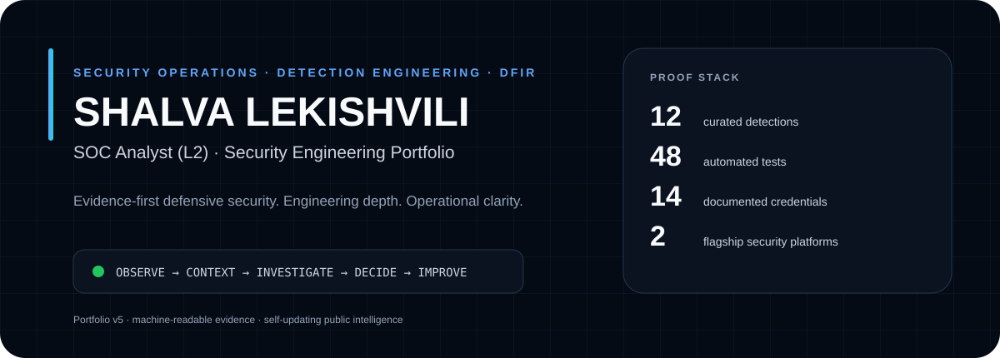
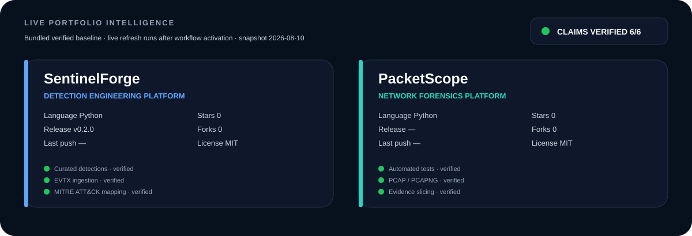
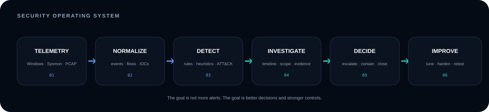
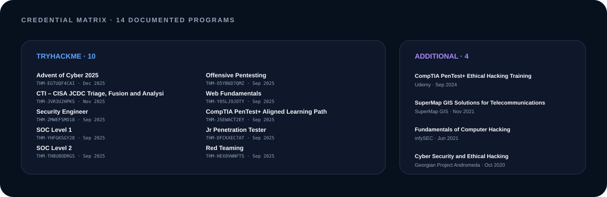
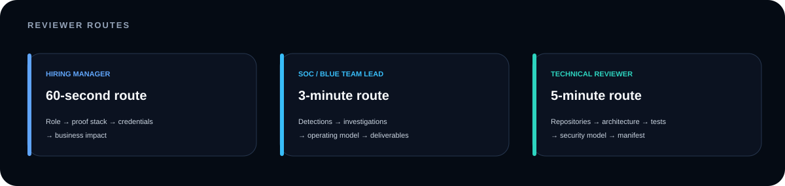

<div align="center">

<picture>
  <source media="(prefers-color-scheme: dark)" srcset="./assets/hero-dark.svg">
  <source media="(prefers-color-scheme: light)" srcset="./assets/hero-light.svg">
  
</picture>
<p align="center">
<a href="https://github.com/Meghna-DAS/github-profile-views-counter">
    
</a>
<a href="https://github.com/ShalvaLekishvili?tab=followers"></a>
</p>

<br>

**[Executive Brief](#executive-brief)** · **[Live Intelligence](#live-portfolio-intelligence)** · **[Engineering Proof](#flagship-security-engineering)** · **[Credentials](#credentials--professional-development)** · **[Operating Model](#security-operating-system)** · **[Contact](#contact)**

<br>

[LinkedIn](https://www.linkedin.com/in/shalva-lekishvili/) · [TryHackMe](https://tryhackme.com/p/ShalvaLekishvili) · [Portfolio](https://lekishvilishalva.netlify.app/) · [Repositories](https://github.com/ShalvaLekishvili?tab=repositories)

</div>

<div align="center">


</div>


<h2 align="center">Profile View</h1>
<div align="center">
  
</div>

# Executive Brief

<table>
<tr>
<td width="66%" valign="top">

## Security operations with engineering depth

I am a **SOC Analyst (L2)** focused on **detection engineering, incident investigation, threat hunting, network forensics, security automation, and authorized security validation**.

My portfolio is built around one rule:

> **A security finding is only useful when it produces evidence, context, scope, a decision, and a stronger control.**

I want a reviewer to be able to inspect the engineering behind the claim—not just read that I know a tool.

**Core operating domains**

`SOC Operations` · `Detection Engineering` · `DFIR` · `Threat Hunting` · `Network Forensics` · `Security Automation`

</td>
<td width="34%" valign="top">

### Proof stack

| Signal | Public evidence |
|---|---:|
| Curated detections | **12** |
| PacketScope tests | **48** |
| Documented credentials | **14** |
| Flagship platforms | **2** |
| Primary engineering language | **Python** |
| Portfolio philosophy | **Evidence-first** |

</td>
</tr>
</table>

---

# Live Portfolio Intelligence

<picture>
  <source media="(prefers-color-scheme: dark)" srcset="./assets/generated/live-intelligence-dark.svg">
  <source media="(prefers-color-scheme: light)" srcset="./assets/generated/live-intelligence-light.svg">
  
</picture>


The panel above is **generated by this repository**, not by a third-party statistics service. A scheduled GitHub Actions workflow queries the GitHub REST API, verifies selected public claims against the flagship project READMEs, and regenerates local SVG assets plus a machine-readable manifest.

**Machine-readable evidence:** [`assets/generated/portfolio-manifest.json`](./assets/generated/portfolio-manifest.json)

The generator has an explicit baseline fallback. If GitHub API collection fails, the output is marked as baseline-backed rather than silently pretending stale information is live.

---

# Flagship Security Engineering

<table>
<tr>
<td width="50%" valign="top">

## 🛡️ [SentinelForge](https://github.com/ShalvaLekishvili/SentinelForge)

**Defensive SOC investigation + detection engineering workbench**

SentinelForge converts blue-team claims into inspectable engineering: telemetry parsers, a normalized event model, detection-as-code, process correlation, IOC extraction, ATT&CK context, analyst workflows, API/CLI surfaces, testing, and CI.

### Public engineering evidence

- Windows `.evtx` ingestion
- Wazuh / Sysmon-friendly normalization
- External YAML detection rules
- **12 curated defensive detections**
- Severity + confidence-aware risk scoring
- IOC extraction for common indicator classes
- PID / PPID process graph correlation
- MITRE ATT&CK technique coverage
- FastAPI + CLI + analyst workspace
- Hardened container baseline
- Tests, CI and dependency maintenance

**Reviewer route:** [README](https://github.com/ShalvaLekishvili/SentinelForge#readme) · [Architecture](https://github.com/ShalvaLekishvili/SentinelForge/tree/main/docs) · [Rules](https://github.com/ShalvaLekishvili/SentinelForge/tree/main/rules) · [Tests](https://github.com/ShalvaLekishvili/SentinelForge/tree/main/tests)

</td>
<td width="50%" valign="top">

## 🌐 [PacketScope](https://github.com/ShalvaLekishvili/PacketScope)

**Local-first network forensics + packet investigation workbench**

PacketScope transforms PCAP / PCAPNG evidence into a structured analyst investigation: hosts, flows, transactions, protocol metadata, findings, evidence slices, analyst state, reports, and investigation pivots.

### Public engineering evidence

- PCAP + PCAPNG ingestion
- DNS / HTTP / TLS / ARP / DHCP / ICMP / NTP metadata
- Host, flow and conversation modeling
- Bounded TCP reconstruction
- Behavioral detection leads
- IOC and transaction context
- Packet-level evidence slicing
- Analyst verdicts, notes and tags
- JSON + self-contained HTML reporting
- FastAPI + CLI + Docker
- Local-first privacy model
- **48 automated tests**

**Reviewer route:** [README](https://github.com/ShalvaLekishvili/PacketScope#readme) · [Architecture](https://github.com/ShalvaLekishvili/PacketScope/tree/main/docs) · [Detections](https://github.com/ShalvaLekishvili/PacketScope/blob/main/docs/DETECTION_MODEL.md) · [Tests](https://github.com/ShalvaLekishvili/PacketScope/tree/main/tests)

</td>
</tr>
</table>

## Evidence Registry

| Capability | SentinelForge | PacketScope | What it demonstrates |
|---|:---:|:---:|---|
| Detection engineering | ✅ | ✅ | Behavior translated into repeatable analyst logic |
| Windows / endpoint telemetry | ✅ | — | Event normalization, process relationships, command context |
| Network telemetry | — | ✅ | Protocol-aware traffic and conversation reconstruction |
| IOC extraction | ✅ | ✅ | Investigation pivots and contextualization |
| Correlation | ✅ | ✅ | Relationships rather than isolated raw events |
| ATT&CK context | ✅ | ✅ | Technique-aware analyst framing |
| Analyst workflow | ✅ | ✅ | Findings connected to review and evidence |
| API / CLI engineering | ✅ | ✅ | Automation and integration surfaces |
| Automated testing | ✅ | ✅ | Reproducible engineering rather than presentation-only claims |
| Defensive boundaries | ✅ | ✅ | Explicit limitations and intended use |

---

# Business & Operational Impact

| Technical work | Security question | Operational output | Business value |
|---|---|---|---|
| Alert triage | Is this signal meaningful? | Evidence-backed disposition | Reduces analyst noise and missed escalation |
| Detection engineering | What behavior must surface consistently? | Tested rule logic + ATT&CK context | Improves repeatability and visibility |
| Endpoint investigation | What executed and what changed? | Process tree, timeline, persistence evidence | Improves incident scope and containment |
| Network forensics | What crossed the wire? | Conversations, protocol metadata, packet evidence | Clarifies communication and data movement |
| Threat hunting | What may exist without an alert? | Hypothesis-driven pivots and findings | Exposes detection gaps |
| Authorized validation | Does the control resist expected abuse? | Reproducible finding + retest | Converts assumptions into verified assurance |
| Automation | What repetitive work can become deterministic? | Scripts, APIs, CLI workflows, reports | Improves speed and consistency |

## Operational Deliverables

<table>
<tr>
<td width="33%" valign="top">

### Investigate
- Evidence triage
- Process-tree reconstruction
- Command-line review
- Persistence analysis
- Timeline building
- IOC extraction
- Scope determination

</td>
<td width="33%" valign="top">

### Detect
- Detection-as-code
- Rule authoring
- ATT&CK mapping
- False-positive analysis
- Detection testing
- Gap identification
- Explainable findings

</td>
<td width="33%" valign="top">

### Communicate
- Incident summaries
- Severity rationale
- Escalation context
- Remediation guidance
- Analyst notes
- Evidence preservation
- Retest documentation

</td>
</tr>
</table>

---

# Security Operating System

<picture>
  <source media="(prefers-color-scheme: dark)" srcset="./assets/operating-system-dark.svg">
  <source media="(prefers-color-scheme: light)" srcset="./assets/operating-system-light.svg">
  
</picture>

```text
TELEMETRY
   ↓
NORMALIZE + CORRELATE
   ↓
DETECT + INVESTIGATE
   ↓
ESTABLISH SCOPE + PRIORITY
   ↓
ESCALATE / CONTAIN / CLOSE
   ↓
TUNE DETECTION + HARDEN CONTROL + DOCUMENT + RETEST
```

The operating goal is not “generate more alerts.” It is **reduce uncertainty until a defensible next action is clear**.

---

# Credentials & Professional Development

<picture>
  <source media="(prefers-color-scheme: dark)" srcset="./assets/generated/credential-matrix-dark.svg">
  <source media="(prefers-color-scheme: light)" srcset="./assets/generated/credential-matrix-light.svg">
  
</picture>

The credentials stay **fully visible**. They support the engineering evidence above; they do not replace it.

## TryHackMe — 10 credentials

| Credential | Completed | Credential ID | Domain |
|---|---:|---|---|
| **Advent of Cyber 2025** | Dec 2025 | `THM-EGTUQF4CAI` | Multi-domain Security |
| **CTI – CISA JCDC Triage, Fusion and Analysis** | Nov 2025 | `THM-JVR3U2HPKS` | Cyber Threat Intelligence |
| **Security Engineer** | Sep 2025 | `THM-2MWEFSMO18` | Security Engineering |
| **SOC Level 1** | Sep 2025 | `THM-YHFGKSGY28` | Security Operations |
| **SOC Level 2** | Sep 2025 | `THM-TH8U8ODRGS` | Advanced SOC Operations |
| **Offensive Pentesting** | Sep 2025 | `THM-O5YB6D7QMZ` | Security Validation |
| **Web Fundamentals** | Sep 2025 | `THM-Y05LJ9JOTY` | Web Security |
| **CompTIA PenTest+ Aligned Learning Path** | Sep 2025 | `THM-JSEWACT2EY` | Penetration Testing |
| **Jr Penetration Tester** | Sep 2025 | `THM-DFCKXEC7AT` | Penetration Testing |
| **Red Teaming** | Sep 2025 | `THM-HEX0VWNFTS` | Adversary Simulation |

## Additional technical training — 4 programs

| Course / Certificate | Provider | Completed | Domain |
|---|---|---:|---|
| **CompTIA PenTest+ Ethical Hacking Training** | Udemy | Sep 2024 | Penetration Testing |
| **SuperMap GIS Solutions for Telecommunications** | SuperMap GIS | Nov 2021 | GIS / Telecommunications |
| **Fundamentals of Computer Hacking** | infySEC | Jun 2021 | Cybersecurity Fundamentals |
| **Cyber Security and Ethical Hacking** | Georgian Project Andromeda | Oct 2020 | Ethical Hacking |

---

# Technical Capability Architecture

<table>
<tr>
<td width="25%" valign="top">

### Security Operations
`SIEM`  
`Wazuh`  
`Windows Events`  
`Sysmon`  
`FortiGate`  
`Triage`  
`Escalation`

</td>
<td width="25%" valign="top">

### Detection Engineering
`Detection-as-Code`  
`MITRE ATT&CK`  
`Rule Testing`  
`IOC Logic`  
`Correlation`  
`Risk Scoring`  
`Behavior Analytics`

</td>
<td width="25%" valign="top">

### DFIR & Hunting
`Timeline Analysis`  
`Process Trees`  
`PCAP`  
`Network Forensics`  
`Threat Hunting`  
`Evidence Handling`  
`Protocol Analysis`

</td>
<td width="25%" valign="top">

### Engineering
`Python`  
`PowerShell`  
`FastAPI`  
`CLI`  
`Docker`  
`Git`  
`GitHub Actions`

</td>
</tr>
</table>

---

# Engineering Principles

<table>
<tr>
<td width="33%" valign="top"><h3>01 · Explainability</h3>A detection should show <strong>why it matched</strong>, what evidence supports it, and what the analyst should verify next.</td>
<td width="33%" valign="top"><h3>02 · Evidence Integrity</h3>Conclusions should remain traceable to source events, packets, timelines, or reproducible validation steps.</td>
<td width="33%" valign="top"><h3>03 · Testable Security</h3>Rules, parsers, detections, and automation should be tested rather than presented as unsupported claims.</td>
</tr>
<tr>
<td width="33%" valign="top"><h3>04 · Privacy by Default</h3>Public demonstrations should prefer synthetic evidence, local processing, redaction, and bounded collection.</td>
<td width="33%" valign="top"><h3>05 · Defensive Scope</h3>Security tooling should support investigation, detection, evidence handling, remediation, and authorized validation.</td>
<td width="33%" valign="top"><h3>06 · Operational Clarity</h3>Every useful output should lead toward investigate, escalate, contain, tune, harden, document, retest, or close.</td>
</tr>
</table>

---

# The Profile Itself Is Engineered

This repository is intentionally designed like a small production system.

```text
config/portfolio.json
        │
        ├── identity + credentials
        └── flagship claim definitions
                │
                ▼
      scripts/profile_engine.py
                │
     ┌──────────┴──────────┐
     ▼                     ▼
GitHub REST API       README verification
     │                     │
     └──────────┬──────────┘
                ▼
     local dark/light SVGs
     portfolio-manifest.json
                │
                ▼
            README.md
```

### Automation hardening

- GitHub REST API version is explicitly pinned to **`2026-03-10`**.
- The workflow runs on a timezone-aware **Asia/Tbilisi** schedule and can also be triggered manually.
- Workflow actions are pinned to **full commit SHAs**.
- `GITHUB_TOKEN` receives only the repository-content permission needed to commit generated assets.
- The workflow never uses `pull_request_target`.
- The generator uses the **Python standard library only**—no runtime package-install supply chain.
- Selected public claims are regex-verified against each flagship repository README.
- Unit tests run before the generated profile is committed.
- A validator checks local assets, SVG validity, credential count, duplicate IDs, and required portfolio sections.
- Dependabot is configured for GitHub Actions maintenance.
- CODEOWNERS covers workflow, script, and configuration changes.

### Local developer commands

```bash
make profile    # generate from bundled verified baseline
make test       # run unit tests
make validate   # validate README/assets/credentials
make all        # run everything
```

See [`docs/GOD_MODE_ARCHITECTURE.md`](./docs/GOD_MODE_ARCHITECTURE.md) for the design.

---

# Reviewer Routes

<picture>
  <source media="(prefers-color-scheme: dark)" srcset="./assets/reviewer-routes-dark.svg">
  <source media="(prefers-color-scheme: light)" srcset="./assets/reviewer-routes-light.svg">
  
</picture>

### Hiring manager — 60 seconds
**Role → proof stack → flagship projects → credentials → business impact**

### SOC / Blue Team lead — 3 minutes
**Detection coverage → analyst workflows → investigation model → operating system → deliverables**

### Technical reviewer — 5+ minutes
**Repository architecture → security boundaries → tests → workflow hardening → generated evidence manifest**

---

# Current Development Vector

```text
01  Detection engineering + SIEM rule quality
02  Advanced Windows / endpoint investigation
03  Cyber threat intelligence + IOC contextualization
04  Active Directory security
05  Network forensics + protocol analysis
06  Web application security validation
07  Python / PowerShell security automation
08  Incident reporting + operational playbooks
```

---

# Portfolio Governance

This GitHub is maintained as a **professional security engineering portfolio**, not merely a repository collection.

- Public claims should have inspectable evidence wherever possible.
- Offensive techniques are presented only in authorized, defensive, educational, or lab context.
- Production-sensitive data is excluded from public demonstrations.
- Flagship repositories should document architecture, testing, limitations, security scope, and roadmap.
- Synthetic evidence is preferred for demonstrations.
- Self-ratings such as “95% expert” are deliberately avoided.
- Stars and followers are not treated as proof of security engineering quality.
- New portfolio claims should be added to the machine-readable configuration when they can be verified.

---

# Contact

<div align="center">

### Open to security operations, detection engineering, threat hunting, and DFIR opportunities
<a href="[https://www.linkedin.com/in/shalva-lekishvili/]" target="_blank">
  
 </a>
 <a href="https://tryhackme.com/p/ShalvaLekishvili" target="_blank">
  
 </a>
    <a href="lekishvilishalva.netlify.app" target="blank">
  
 </a>
   <a href="lekishvilishalva@gmail.com" target="_blank">
  
 </a> 
 <a href="https://github.com/ShalvaLekishvili" target="_blank">
  
 </a>
<br>

<picture>
  <source media="(prefers-color-scheme: dark)" srcset="./assets/footer-dark.svg">
  <source media="(prefers-color-scheme: light)" srcset="./assets/footer-light.svg">
  
</picture>

</div>
