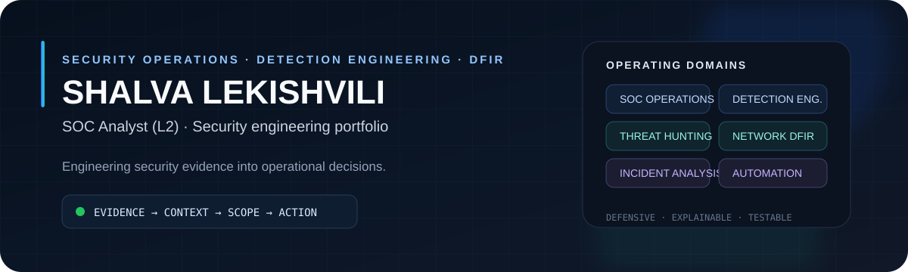
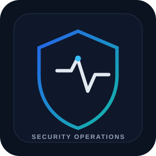
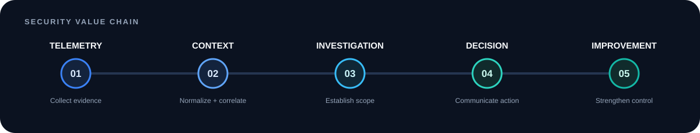
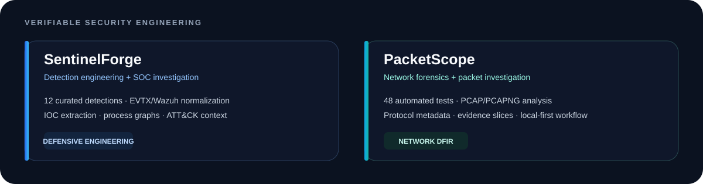
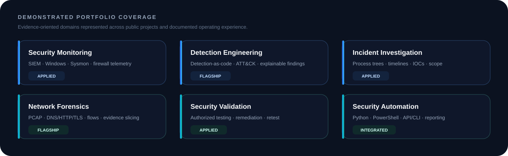
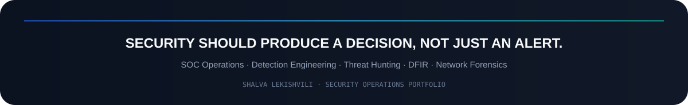

<div align="center">



<br>

<a href="https://www.linkedin.com/in/shalva-lekishvili/">
  
</a>
<a href="https://tryhackme.com/p/ShalvaLekishvili">
  
</a>
<a href="https://lekishvilishalva.netlify.app/">
  
</a>
<a href="https://github.com/ShalvaLekishvili?tab=repositories">
  
</a>

<br><br>


</div>

<br>

<table>
<tr>
<td width="31%" align="center" valign="middle">



</td>
<td width="69%" valign="top">

## Executive Security Brief

**SOC Analyst (L2) focused on turning technical telemetry into decisions that reduce operational risk.**

I work across security monitoring, detection engineering, incident investigation, network forensics, and authorized security validation. The objective is not simply to identify suspicious behavior—it is to establish evidence, determine scope, explain impact, and improve the control that failed.

> **Evidence → Context → Scope → Decision → Control Improvement**

**Primary operating domains:** SOC Operations · Detection Engineering · DFIR · Threat Hunting · Network Forensics · Security Validation

</td>
</tr>
</table>


## Security Value Proposition

<div align="center">

</div>

<table>
<tr>
<td width="25%" valign="top">

### Detect
Reduce signal-to-noise by connecting telemetry to explainable behaviors and detections.

</td>
<td width="25%" valign="top">

### Investigate
Reconstruct endpoint and network activity into evidence-backed timelines and process relationships.

</td>
<td width="25%" valign="top">

### Validate
Test assumptions and controls in explicitly authorized environments to expose gaps before incidents do.

</td>
<td width="25%" valign="top">

### Improve
Translate findings into detection logic, hardening actions, investigation procedures, and reusable playbooks.

</td>
</tr>
</table>


## Portfolio Proof — Flagship Engineering

<div align="center">

</div>

<table>
<tr>
<td width="50%" valign="top">

### 🛡️ [SentinelForge](https://github.com/ShalvaLekishvili/SentinelForge)
**Defensive SOC investigation + detection engineering workbench**

SentinelForge turns SOC knowledge into inspectable engineering: normalized telemetry, external YAML detection rules, process correlation, IOC extraction, ATT&CK context, an API, CLI, analyst UI, tests, and CI.

**Public proof**
- EVTX, JSON/Wazuh, CSV and text-oriented telemetry ingestion
- Wazuh/Sysmon-friendly normalized event model
- **12 curated defensive detections**
- Severity + confidence-aware scoring
- PID/PPID process graph correlation
- IOC extraction and ATT&CK coverage
- Hardened container baseline + CI

`Python` `FastAPI` `EVTX` `Wazuh` `Sysmon` `Detection-as-Code` `MITRE ATT&CK`

</td>
<td width="50%" valign="top">

### 🌐 [PacketScope](https://github.com/ShalvaLekishvili/PacketScope)
**Local-first network forensics + packet investigation workbench**

PacketScope transforms PCAP/PCAPNG evidence into an analyst investigation model: hosts, conversations, protocol transactions, detections, IOCs, evidence slices, reports, and analyst annotations.

**Public proof**
- PCAP + PCAPNG analysis
- DNS / HTTP / TLS / ARP / DHCP / ICMP / NTP metadata
- Bounded TCP reconstruction
- Host, conversation and IOC modeling
- Behavior detections + risk-ranked findings
- Packet-level evidence slicing
- FastAPI, CLI, Docker and self-contained reports
- **48 automated tests**

`Python` `PCAP` `DFIR` `Network Forensics` `FastAPI` `Docker` `Evidence Handling`

</td>
</tr>
</table>

<div align="center">
<a href="https://github.com/ShalvaLekishvili/SentinelForge">
  
</a>
<a href="https://github.com/ShalvaLekishvili/PacketScope">
  
</a>
</div>


## Executive Capability Scorecard

<div align="center">

</div>

> This scorecard represents **portfolio coverage and demonstrated operating areas**, not an arbitrary self-rating.

| Capability | What I work on | Business relevance |
|---|---|---|
| **Security Monitoring** | SIEM telemetry, Windows events, Sysmon, firewall events, triage | Faster separation of meaningful activity from routine noise |
| **Detection Engineering** | Detection-as-code, ATT&CK mapping, rule tuning, explainable evidence | More consistent detection logic and easier analyst validation |
| **Incident Investigation** | Process trees, command lines, persistence, timelines, IOC context | Better scoping, escalation, and defensible incident decisions |
| **Network Forensics** | PCAP analysis, DNS/HTTP/TLS, beaconing, flow reconstruction | Visibility into suspicious communication and data movement |
| **Security Validation** | Authorized enumeration, web/control validation, remediation retest | Identifies control gaps before they become operational incidents |
| **Security Automation** | Python, PowerShell, API/CLI workflows, reporting | Reduces repetitive work and improves repeatability |


## From Technical Work to Business Outcome

<table>
<tr>
<th align="left">Technical activity</th>
<th align="left">Operational question answered</th>
<th align="left">Useful output</th>
</tr>
<tr>
<td>Detection rule engineering</td>
<td>What behavior should the SOC surface consistently?</td>
<td>Rule logic, ATT&CK context, test data, false-positive guidance</td>
</tr>
<tr>
<td>Endpoint investigation</td>
<td>What executed, how, and what changed?</td>
<td>Process tree, timeline, persistence evidence, scope assessment</td>
</tr>
<tr>
<td>Network investigation</td>
<td>What communicated, with whom, and how often?</td>
<td>Flow evidence, protocol metadata, IOCs, packet slices</td>
</tr>
<tr>
<td>Authorized validation</td>
<td>Does the control actually resist the expected behavior?</td>
<td>Reproducible finding, impact explanation, remediation + retest</td>
</tr>
<tr>
<td>Incident reporting</td>
<td>What decision should engineering or leadership make next?</td>
<td>Evidence summary, severity rationale, containment / improvement actions</td>
</tr>
</table>


## Security Operating Model

```text
TELEMETRY
   │
   ├── Endpoint / Windows / Sysmon
   ├── Network / PCAP / Protocol metadata
   ├── Firewall / Security controls
   └── Investigation artifacts
   │
   ▼
NORMALIZE + CORRELATE
   │
   ├── Process relationships
   ├── Conversations / transactions
   ├── IOC extraction
   └── ATT&CK context
   │
   ▼
DETECT + INVESTIGATE
   │
   ├── Explainable findings
   ├── Confidence / severity
   ├── Timeline + scope
   └── Evidence preservation
   │
   ▼
DECIDE + IMPROVE
       ├── Escalate / contain
       ├── Tune detection
       ├── Harden control
       └── Document / retest
```


## Technical Stack

<div align="center">

**Monitoring · Detection · Investigation**


**Network · Validation**


**Engineering · Automation**


</div>


## Engineering Standards

<table>
<tr>
<td width="33%" valign="top">

### Explainability
Security outputs should show **why** something matched, what evidence supports it, and what the analyst should verify next.

</td>
<td width="33%" valign="top">

### Privacy by Default
Portfolio demonstrations should prefer local processing, bounded collection, redaction, and synthetic evidence wherever possible.

</td>
<td width="33%" valign="top">

### Testable Security
Rules, parsers, and analysis logic should be backed by repeatable tests rather than presentation-only claims.

</td>
</tr>
<tr>
<td width="33%" valign="top">

### Defensive Scope
Security tooling is built for investigation, validation, detection, evidence handling, and remediation.

</td>
<td width="33%" valign="top">

### Operational Clarity
A useful finding should lead to a next action: investigate, contain, tune, harden, document, or close.

</td>
<td width="33%" valign="top">

### Continuous Improvement
Every incident, false positive, and validation result should improve the next detection or control decision.

</td>
</tr>
</table>


## Training & Credentials

<details>
<summary><strong>TryHackMe learning paths and credentials</strong></summary>
<br>

| Learning path / credential | Completed | Credential ID |
|---|---:|---|
| Advent of Cyber 2025 | Dec 2025 | `THM-EGTUQF4CAI` |
| CTI – CISA JCDC Triage, Fusion and Analysis | Nov 2025 | `THM-JVR3U2HPKS` |
| Security Engineer | Sep 2025 | `THM-2MWEFSMO18` |
| SOC Level 1 | Sep 2025 | `THM-YHFGKSGY28` |
| SOC Level 2 | Sep 2025 | `THM-TH8U8ODRGS` |
| Offensive Pentesting | Sep 2025 | `THM-O5YB6D7QMZ` |
| Web Fundamentals | Sep 2025 | `THM-Y05LJ9JOTY` |
| CompTIA PenTest+ Aligned Learning Path | Sep 2025 | `THM-JSEWACT2EY` |
| Jr Penetration Tester | Sep 2025 | `THM-DFCKXEC7AT` |
| Red Teaming | Sep 2025 | `THM-HEX0VWNFTS` |

</details>

<details>
<summary><strong>Additional technical training</strong></summary>
<br>

| Course / certificate | Provider | Completed |
|---|---|---:|
| CompTIA PenTest+ Ethical Hacking Training | Udemy | Sep 2024 |
| SuperMap GIS Solutions for Telecommunications | SuperMap GIS | Nov 2021 |
| Fundamentals of Computer Hacking | infySEC | Jun 2021 |
| Cyber Security and Ethical Hacking | Georgian Project Andromeda | Oct 2020 |

</details>


## Current Development Vector

```text
01  Detection engineering + rule quality
02  Advanced Windows / endpoint investigation
03  Cyber threat intelligence + IOC contextualization
04  Active Directory security
05  Network forensics + protocol analysis
06  Web application security validation
07  Python / PowerShell security automation
08  Incident reporting + operational playbooks
```

<details>
<summary><strong>GitHub activity</strong></summary>
<br>

<div align="center">


<br><br>

<picture>
  <source media="(prefers-color-scheme: dark)" srcset="https://raw.githubusercontent.com/ShalvaLekishvili/ShalvaLekishvili/output/github-contribution-grid-snake-dark.svg">
  <source media="(prefers-color-scheme: light)" srcset="https://raw.githubusercontent.com/ShalvaLekishvili/ShalvaLekishvili/output/github-contribution-grid-snake.svg">
  
</picture>
</div>

</details>


<div align="center">



### Open to security operations, detection engineering, threat hunting, and DFIR opportunities

<a href="https://www.linkedin.com/in/shalva-lekishvili/">
  
</a>
<a href="https://github.com/ShalvaLekishvili">
  
</a>
<a href="https://tryhackme.com/p/ShalvaLekishvili">
  
</a>

<br><br>

<sub>AUTHORIZED SECURITY RESEARCH ONLY · EVIDENCE OVER ASSUMPTIONS · SECURITY AS AN OPERATIONAL DISCIPLINE</sub>

</div>
