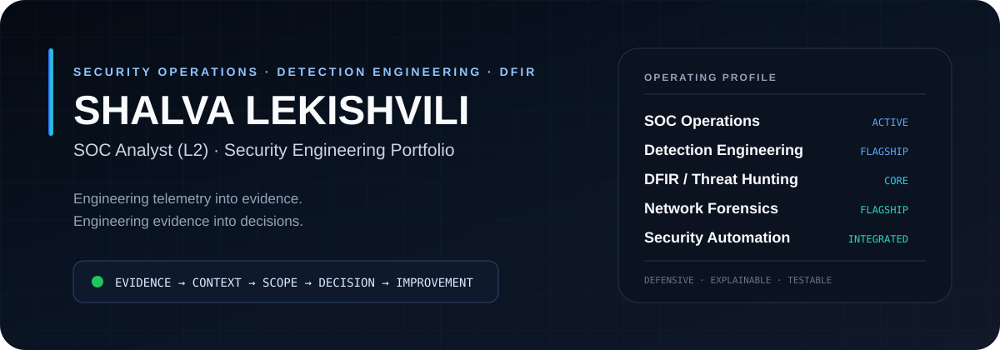
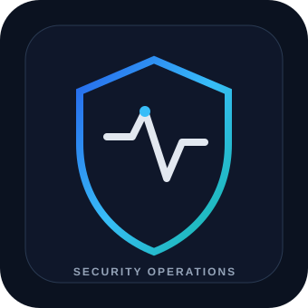
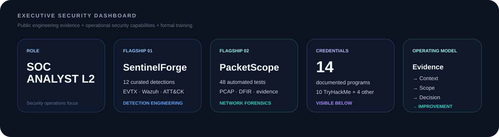
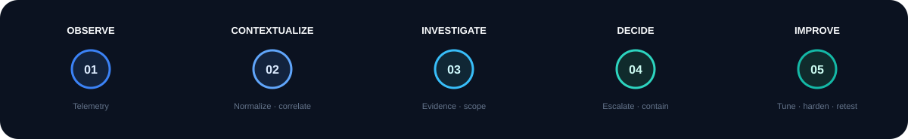
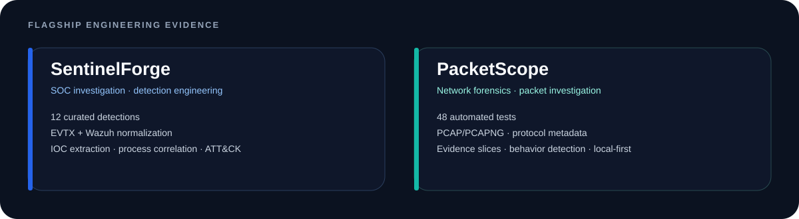
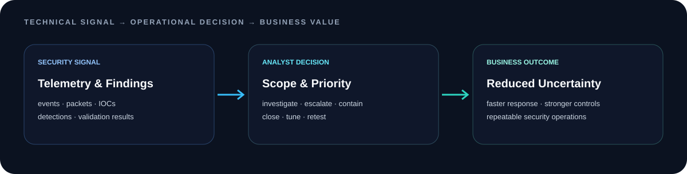
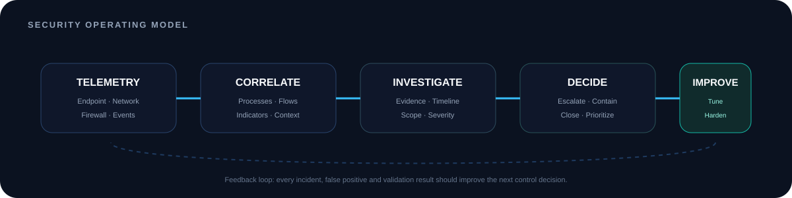
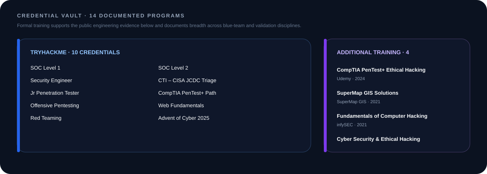
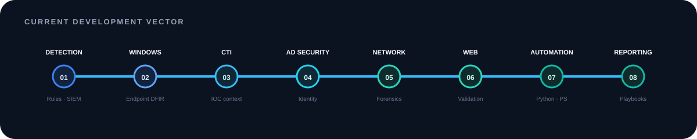
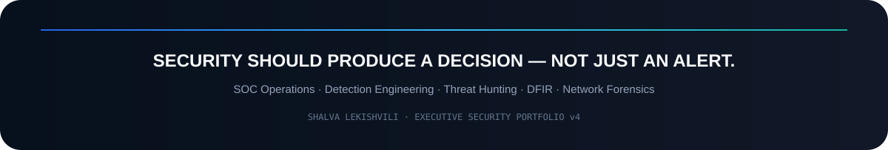

<div align="center">



<br>

<a href="#executive-profile"></a>
<a href="#flagship-security-engineering"></a>
<a href="#credentials--professional-development"></a>
<a href="#technical-stack"></a>

<br><br>

<a href="https://www.linkedin.com/in/shalva-lekishvili/"></a>
<a href="https://tryhackme.com/p/ShalvaLekishvili"></a>
<a href="https://lekishvilishalva.netlify.app/"></a>
<a href="https://github.com/ShalvaLekishvili?tab=repositories"></a>

<br><br>


</div>

<br>

# Executive Profile

<table>
<tr>
<td width="33%" align="center" valign="middle">

</td>
<td width="67%" valign="top">

### Security operations with engineering depth

I am a **SOC Analyst (L2)** focused on detection engineering, incident investigation, threat hunting, network forensics, and authorized security validation.

My work follows one operating principle:

> **A security finding is only useful when it produces evidence, context, scope, a decision, and a stronger control.**

I build and document workflows that help answer:

**What happened? · Why did it matter? · How far did it go? · What should change next?**

`SOC Operations` `Detection Engineering` `DFIR` `Threat Hunting` `Network Forensics` `Security Automation`

</td>
</tr>
</table>

<div align="center">

</div>

---

## Security Value Model

<table>
<tr>
<td width="20%" align="center"><strong>01<br>OBSERVE</strong><br><sub>Telemetry & evidence</sub></td>
<td width="20%" align="center"><strong>02<br>CONTEXTUALIZE</strong><br><sub>Normalize & correlate</sub></td>
<td width="20%" align="center"><strong>03<br>INVESTIGATE</strong><br><sub>Establish scope</sub></td>
<td width="20%" align="center"><strong>04<br>DECIDE</strong><br><sub>Prioritize action</sub></td>
<td width="20%" align="center"><strong>05<br>IMPROVE</strong><br><sub>Strengthen controls</sub></td>
</tr>
</table>

<div align="center"></div>

---

# Flagship Security Engineering

<div align="center"></div>

<table>
<tr>
<td width="50%" valign="top">

## 🛡️ [SentinelForge](https://github.com/ShalvaLekishvili/SentinelForge)

**Defensive SOC investigation + detection engineering workbench**

A public engineering project designed to make SOC capabilities inspectable rather than merely claimed.

### What it proves
- Windows `.evtx` ingestion
- Wazuh / Sysmon-friendly normalization
- External YAML detection-as-code
- **12 curated defensive detections**
- Severity + confidence-aware scoring
- IOC extraction
- PID / PPID process correlation
- MITRE ATT&CK coverage
- API + CLI + analyst interface
- Tests, CI, Dependabot and hardened container baseline

`Python` `FastAPI` `EVTX` `Wazuh` `Sysmon` `YAML` `Detection-as-Code` `MITRE ATT&CK`

<a href="https://github.com/ShalvaLekishvili/SentinelForge"></a>

</td>
<td width="50%" valign="top">

## 🌐 [PacketScope](https://github.com/ShalvaLekishvili/PacketScope)

**Local-first network forensics + packet investigation workbench**

A DFIR-focused project that transforms raw PCAP evidence into an analyst-oriented investigation model.

### What it proves
- PCAP + PCAPNG analysis
- DNS / HTTP / TLS / ARP / DHCP / ICMP / NTP metadata
- Bounded TCP reconstruction
- Host + conversation modeling
- IOC extraction
- Behavior detections
- Packet-level evidence slicing
- Analyst annotations + reports
- API + CLI + Docker
- **48 automated tests**

`Python` `PCAP` `DFIR` `Network Forensics` `FastAPI` `Docker` `Evidence Handling`

<a href="https://github.com/ShalvaLekishvili/PacketScope"></a>

</td>
</tr>
</table>

---

## Portfolio Evidence Index

| Evidence area | SentinelForge | PacketScope | Operational relevance |
|---|:---:|:---:|---|
| Detection engineering | ✅ | ✅ | Turns threat behavior into repeatable analyst logic |
| Endpoint telemetry | ✅ | — | Builds process, command-line and event context |
| Network telemetry | — | ✅ | Reconstructs communication and protocol behavior |
| IOC extraction | ✅ | ✅ | Supports enrichment, scoping and investigation pivots |
| Correlation | ✅ | ✅ | Connects isolated events into explainable relationships |
| Analyst workflow | ✅ | ✅ | Converts technical output into usable investigation steps |
| Automated testing | ✅ | ✅ | Makes security logic reproducible and reviewable |
| Privacy-conscious demos | ✅ | ✅ | Keeps public evidence synthetic/local-first |
| API / CLI engineering | ✅ | ✅ | Supports automation and integration workflows |

---

# Business & Operational Impact

<div align="center"></div>

| Technical activity | Security question answered | Operational output | Business value |
|---|---|---|---|
| SIEM / alert triage | Is this signal meaningful? | Evidence-backed disposition | Reduces wasted analyst time and missed escalation |
| Detection engineering | What behavior must surface consistently? | Tested logic + ATT&CK context | Improves repeatability and visibility |
| Endpoint investigation | What executed and what changed? | Process tree, timeline, persistence evidence | Improves incident scope and containment |
| Network forensics | What actually crossed the wire? | Conversations, protocol metadata, packet evidence | Clarifies suspicious communication and data movement |
| Threat hunting | What could be present without an alert? | Hypothesis-driven findings and pivots | Finds gaps before repeated incidents |
| Authorized validation | Does the control resist expected abuse? | Reproducible finding + remediation retest | Converts assumptions into verified assurance |
| Automation | What repetitive work can be deterministic? | Scripts, API/CLI workflows, reports | Improves speed and consistency |

---

## Operational Deliverables

<table>
<tr>
<td width="33%" valign="top">

### Investigation
- Evidence triage
- Process-tree reconstruction
- Command-line analysis
- Persistence review
- IOC extraction
- Timeline building
- Scope determination

</td>
<td width="33%" valign="top">

### Detection
- Detection-as-code
- Rule logic
- ATT&CK mapping
- False-positive analysis
- Rule testing
- Detection-gap identification
- Alert explanation

</td>
<td width="33%" valign="top">

### Communication
- Incident summaries
- Severity rationale
- Escalation context
- Remediation guidance
- Analyst notes
- Evidence preservation
- Retest documentation

</td>
</tr>
</table>

---

# Security Operating Model

<div align="center"></div>

```text
                         SECURITY OPERATIONS LOOP

      ┌──────────────────── TELEMETRY ────────────────────┐
      │ Endpoint · Windows · Sysmon · Network · Firewall │
      └─────────────────────────┬─────────────────────────┘
                                │
                                ▼
                    NORMALIZE + CORRELATE
              events · processes · flows · indicators
                                │
                                ▼
                      DETECT + INVESTIGATE
                evidence · context · scope · timeline
                                │
                     ┌──────────┴──────────┐
                     ▼                     ▼
                  ESCALATE               CLOSE
                     │                     │
                     └──────────┬──────────┘
                                ▼
                         CONTROL IMPROVEMENT
             detection tuning · hardening · playbooks · retest
```

---

# Credentials & Professional Development

<div align="center"></div>

> **Credentials are visible here intentionally.** They support the engineering evidence above and document the formal learning paths behind the work.

## 🟦 TryHackMe — Security Learning Paths & Credentials

| Credential | Completed | Credential ID | Domain |
|---|---:|---|---|
| **Advent of Cyber 2025** | Dec 2025 | `THM-EGTUQF4CAI` | Multi-domain security |
| **CTI – CISA JCDC Triage, Fusion and Analysis** | Nov 2025 | `THM-JVR3U2HPKS` | Cyber Threat Intelligence |
| **Security Engineer** | Sep 2025 | `THM-2MWEFSMO18` | Security Engineering |
| **SOC Level 1** | Sep 2025 | `THM-YHFGKSGY28` | Security Operations |
| **SOC Level 2** | Sep 2025 | `THM-TH8U8ODRGS` | Advanced SOC Operations |
| **Offensive Pentesting** | Sep 2025 | `THM-O5YB6D7QMZ` | Security Validation |
| **Web Fundamentals** | Sep 2025 | `THM-Y05LJ9JOTY` | Web Security |
| **CompTIA PenTest+ Aligned Learning Path** | Sep 2025 | `THM-JSEWACT2EY` | Penetration Testing |
| **Jr Penetration Tester** | Sep 2025 | `THM-DFCKXEC7AT` | Penetration Testing |
| **Red Teaming** | Sep 2025 | `THM-HEX0VWNFTS` | Adversary Simulation |

## 🟪 Additional Technical Training

| Course / Certificate | Provider | Completed | Domain |
|---|---|---:|---|
| **CompTIA PenTest+ Ethical Hacking Training** | Udemy | Sep 2024 | Penetration Testing |
| **SuperMap GIS Solutions for Telecommunications** | SuperMap GIS | Nov 2021 | GIS / Telecommunications |
| **Fundamentals of Computer Hacking** | infySEC | Jun 2021 | Cybersecurity Fundamentals |
| **Cyber Security and Ethical Hacking** | Georgian Project Andromeda | Oct 2020 | Ethical Hacking |

<div align="center">


</div>

---

# Technical Stack

<div align="center">

### Detection · Monitoring · Incident Investigation


### Network · Validation


### Engineering · Automation


</div>

---

## Capability Architecture

<table>
<tr>
<td width="25%" valign="top"><h3>Security Operations</h3><code>SIEM</code> <code>Triage</code> <code>Escalation</code> <code>Incident Analysis</code> <code>Windows Events</code> <code>Sysmon</code></td>
<td width="25%" valign="top"><h3>Detection Engineering</h3><code>Detection-as-Code</code> <code>MITRE ATT&CK</code> <code>Rule Testing</code> <code>IOC Logic</code> <code>Correlation</code></td>
<td width="25%" valign="top"><h3>DFIR & Hunting</h3><code>Timeline Analysis</code> <code>Process Trees</code> <code>PCAP</code> <code>Network Forensics</code> <code>Threat Hunting</code></td>
<td width="25%" valign="top"><h3>Engineering</h3><code>Python</code> <code>PowerShell</code> <code>FastAPI</code> <code>CLI</code> <code>Docker</code> <code>GitHub Actions</code></td>
</tr>
</table>

---

# Engineering Principles

<table>
<tr>
<td width="33%" valign="top"><h3>01 · Explainability</h3>A detection should explain <strong>why it matched</strong>, what evidence supports it, and what the analyst should verify next.</td>
<td width="33%" valign="top"><h3>02 · Evidence Integrity</h3>Conclusions should remain traceable to source events, packets, timelines, or reproducible validation steps.</td>
<td width="33%" valign="top"><h3>03 · Testable Security</h3>Rules, parsers and security logic should be tested rather than presented as unsupported claims.</td>
</tr>
<tr>
<td width="33%" valign="top"><h3>04 · Privacy by Default</h3>Public demos should prefer synthetic data, local processing, redaction and bounded collection.</td>
<td width="33%" valign="top"><h3>05 · Defensive Scope</h3>Security tooling should support investigation, detection, evidence handling, remediation and authorized validation.</td>
<td width="33%" valign="top"><h3>06 · Operational Clarity</h3>Every useful output should lead to a next action: investigate, escalate, contain, tune, harden, document or close.</td>
</tr>
</table>

---

# Current Development Vector

<div align="center"></div>

```text
01  Detection engineering + SIEM rule development
02  Advanced Windows / endpoint investigation
03  Cyber threat intelligence + IOC contextualization
04  Active Directory security
05  Network forensics + protocol analysis
06  Web application security validation
07  Python / PowerShell security automation
08  Incident reporting + operational playbooks
```

---

## Portfolio Governance

This GitHub is maintained as a **professional security engineering portfolio**, not simply a repository collection.

- Public claims should be backed by public evidence where possible.
- Offensive techniques are documented only in authorized, defensive, educational or lab context.
- Production-sensitive data is not used in public demonstrations.
- Project READMEs should explain architecture, testing, limitations, security scope and roadmap.
- Flagship projects should contain reproducible setup instructions and evidence of active engineering.

---

<details>
<summary><strong>GitHub activity & contribution signals</strong></summary>
<br>
<div align="center">


<br><br>
<picture>
<source media="(prefers-color-scheme: dark)" srcset="https://raw.githubusercontent.com/ShalvaLekishvili/ShalvaLekishvili/output/github-contribution-grid-snake-dark.svg">
<source media="(prefers-color-scheme: light)" srcset="https://raw.githubusercontent.com/ShalvaLekishvili/ShalvaLekishvili/output/github-contribution-grid-snake.svg">

</picture>
</div>
</details>

---

<div align="center">


## Open to security operations, detection engineering, threat hunting and DFIR opportunities

<a href="https://www.linkedin.com/in/shalva-lekishvili/"></a>
<a href="https://github.com/ShalvaLekishvili"></a>
<a href="https://tryhackme.com/p/ShalvaLekishvili"></a>

<br><br>
<sub><strong>AUTHORIZED SECURITY RESEARCH ONLY</strong> · EVIDENCE OVER ASSUMPTIONS · SECURITY AS AN OPERATIONAL DISCIPLINE</sub>
</div>
